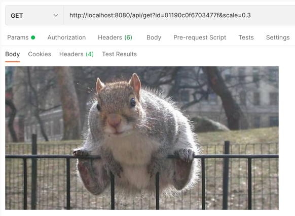

# Сервис сохранения картинок 

## Апи
* Swagger: [http://localhost:8080/docs](http://localhost:8080/docs)
* `upload`:
   * Swagger - [тык](http://localhost:8080/docs#/uploader/post_api_upload)
   * формат:
     * [http://localhost:8080/api/upload](http://localhost:8080/api/upload) - jpg-изображение в теле запроса
   * Swagger - [тык](http://localhost:8080/docs#/getter/get_api_get)
   * Формат:
     * [http://localhost:8080/api/get?id=IMAGE_ID](http://localhost:8080/api/get?id=IMAGE_ID)
     * [http://localhost:8080/api/get?id=IMAGE_ID&scale=SCALE](http://localhost:8080/api/get?id=IMAGE_ID&scale=SCALE)
* example script: [scripts/example.sh](scripts/example.sh)

## Примеры запрососв
get:
```shell
curl --location --request GET 'http://localhost:8080/api/get?id=01190c0f6703477f'
```

upload:
```shell
curl --location --request POST 'http://localhost:8080/api/upload' \
--header 'Content-Type: image/jpeg' \
--data-binary '@images/test_0.5x.jpg'
```

## Описание
Картинки сохраняются в MySQL как `LONGBLOB`ы.

Для кэширования используется read-through Redis. Первый раз картинка загружается из MySQL затем из Redis.

Логи записываются в `logs/application.log`.

Если загрузить картинку, которая уже сохранена, но в более высоком разрешении, то старая картинка будет перезаписана:

Для скейлинга используется `opencv`.

## Примеры ответов
Несуществующий путь:
```shell
404: Not Found
```

Неподдерживаемый метод (GET в `upload`, например):
```shell
405: Method Not Allowed
```

### get


`get` с неусщетсвующим идентификатором:
```json
{
    "status_code": 404,
    "message": "Image with id equal to '01190c0f6703477fa' was not found"
}
```

`get` без идентификатора:
```json
{
    "status_code": 400,
    "message": "{'id': ['Missing data for required field.']}"
}
```

`get` с некорректным `scale`:
```json
{
    "status_code": 400,
    "message": "{'scale': ['Not a valid number.']}"
}
```

### upload

```json
{
    "id": "01190c0f6703477f",
    "message": "Ok"
}
```

`upload` с неподдерживаемым типом файла:
```json
{
    "status_code": 405,
    "message": "Only JPEG images are allowed"
}
```

`upload` существующего изображения:
```json
{
    "id": "01190c0f6703477f",
    "message": "Image with already exists and stored with id - '01190c0f6703477f'"
}
```